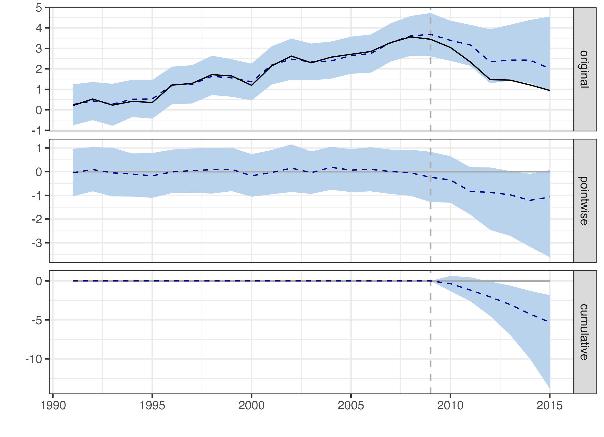

# Impact of League of Legends Release on North American Video Game Sales

Author: Kenith Chan

## Overview

This project investigates the impact of the release of **League of Legends (LOL)** on video game sales in **North America (NA)** using the **CausalImpact** package in R. The study aims to determine whether the launch of LOL in 2009 significantly affected the overall sales of other video games in the NA region. By analyzing video game sales data alongside economic indicators, the analysis offers insights into how a highly popular game release can influence broader market trends.

## Project Structure

The project is organized as follows:

- **1_data/**: Contains the input datasets used for the analysis.
  - `vgsales.csv`: Video game sales data by region and year
  - `gdppercapita_ppp_worldbank.csv`: GDP per capita data from the World Bank.
  - `population_worldbank.csv`: Population data from the World Bank.
  - `unemployment_worldbank.csv`: Unemployment rates from the World Bank.
  - `internetuser_worldbank.csv`: Internet penetration data from the World Bank.
- **2_analysis/**: Contains the R Markdown file and the output plot.
  - `analysis.Rmd`: The primary analysis script that includes data preparation, cleaning, and the CausalImpact analysis.
  - `causal_impact_plot.png`: The resulting plot from the CausalImpact analysis, showing the observed and predicted trends of NA video game sales.

## Analysis Methodology

1. **Data Preparation**:
   - Video game sales data was cleaned and aggregated by region and year.
   - Supplementary data from the World Bank was merged with the sales data, including GDP per capita, population, unemployment rate, and internet penetration rates for the US.
   - All data was adjusted for inflation using Consumer Price Index (CPI) data.

2. **Intervention Analysis**:
   - The study focused on the release of League of Legends in October 2009.
   - The analysis considered pre-intervention (1991–2009) and post-intervention (2010–2015) periods.
   - The CausalImpact package was used to create a Bayesian structural time-series model, comparing actual video game sales to a counterfactual scenario where LOL was not released.

3. **Control Variables**:
   - Control variables included sales data from other regions (EU, JP, and Others), number of game releases, GDP per capita, population size, unemployment rate, and internet penetration rate in the US.

---

## Results

### Key Findings

- **Impact of LOL Release**:
  - The analysis revealed that the release of LOL was associated with a **significant 33% decrease** in North American video game sales during the post-intervention period compared to the counterfactual prediction.
  - The **average NA sales** during the post-intervention period were **1.74 million**, while the expected average sales without the intervention would have been **2.63 million**.
  - The **absolute effect** was a reduction of **-0.88 million** in average sales, with a 95% confidence interval of **[-2.30, -0.30]**, indicating a statistically significant negative impact.

- **Cumulative Impact**:
  - The total sales during the post-intervention period were **10.46 million**, compared to an expected **15.77 million** if LOL had not been released.
  - This results in a **cumulative reduction of -5.31 million** in NA video game sales due to the release of LOL, with a 95% interval of **[-9.81, -1.82]**.

- **Statistical Significance**:
  - The probability of observing such an effect by chance is **0.007**, making the impact statistically significant at the 5% level.
  - The analysis concludes that the release of LOL likely diverted consumer attention and spending away from other video games in the region.

### Result Visualization

The plots below shows the actual versus expected video game sales in North America after the release of League of Legends:



The **solid line** represents the observed sales in NA, while the **dashed line** represents the predicted sales if LOL had not been released. The **shaded blue area** around the prediction line represents the 95% confidence interval of the counterfactual prediction. The visible gap between the actual observed values and the predicted values post-2009 highlights the negative impact of LOL on NA video game sales. The second panel displays the pointwise difference between the observed and predicted values, showing the immediate impact over time, while the third panel aggregates these differences to show the cumulative effect of the intervention.

---

## Conclusion

The study demonstrates that the release of League of Legends in 2009 had a significant negative impact on overall video game sales in North America. This suggests that LOL’s popularity and its free-to-play model may have diverted a substantial portion of consumer spending and engagement away from other video games during the post-intervention period. The findings are valuable for game developers, marketers, and industry analysts in understanding how major game releases can reshape market dynamics and influence consumer behavior.

## Future Work

- **Placebo Tests**: To further validate the results, placebo tests could be performed on other regions to confirm the specific impact on NA.
- **Extended Analysis**: Analyzing a longer post-intervention period could provide insights into the long-term effects of LOL’s release.
- **Genre-Specific Impact**: Investigating how specific genres were affected by LOL’s popularity could yield more targeted insights for game developers.

## How to Reproduce the Analysis

1. **Clone the Repository**:
   ```
   git clone https://github.com/ken1th/LOL-VideoGame-casualimpact.git
   cd LOL-VideoGame-casualimpact
   ```

2. **Run the Analysis**:
   - Open `2_analysis/analysis.Rmd` in RStudio.
   - Knit the R Markdown file to generate the analysis results.

3. **View the Results**: The output files, including the `causal_impact_plot.png`, will be available in the `2_analysis/` and `3_output/` folders.

---

## References

- Video Game Sales Dataset: https://www.kaggle.com/datasets/gregorut/videogamesales
- World Bank Open Data: https://data.worldbank.org/
- CausalImpact Package Documentation: https://google.github.io/CausalImpact/CausalImpact.html

Feel free to reach out if you have any questions or suggestions for further analysis!